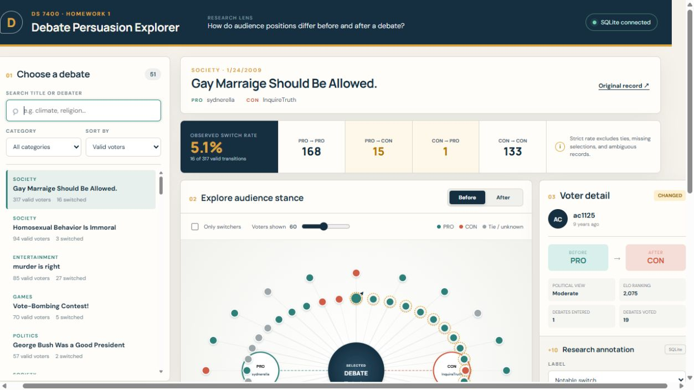

# Debate Persuasion Explorer

An interactive web viewer for examining how Debate.org users' **recorded positions differ before and after online debates**. This is the HW1 foundation for a later deep-learning application that will model personalized stance change from user history, debate text, and potentially network context.

The viewer is descriptive. A before/after difference is an **observed position change**, not proof that the debate caused persuasion.



## Data

The project uses the DDO dataset collected from Debate.org by Esin Durmus and Claire Cardie. The raw files include debate metadata, full argument rounds, audience votes, and user profiles.

The preprocessing script streamed through the supplied raw files and found:

| Audit measure | Result |
|---|---:|
| Debates | 78,376 |
| Vote records | 199,210 |
| Strictly valid before/after transitions | 66,297 |
| Observed switchers | 4,239 |
| Overall strict switch rate | 6.39% |
| Debates with at least 10 valid voters | 835 |

A strict transition requires one unambiguous PRO or CON choice both before and after. Ties, missing selections, and contradictory selections are retained as non-strict labels and excluded from the denominator. See [`outputs/audit_summary.json`](outputs/audit_summary.json) for the complete audit.

The 1.23 GB `debates.json` and 244 MB `users.json` files are **not committed**. The repository contains a reproducible 51-debate sample (about 2 MB) selected for useful viewer interactions and complete argument text.

## Implemented features

- Search, category filter, and several sort modes for debate selection
- Debate metadata, PRO/CON participants, transition matrix, and strict switch rate
- Interactive heterogeneous network of a debate, debaters, and voter nodes
- Before/after toggle that changes node color using real recorded stances
- Mouse-wheel zoom, pointer pan, node hover, node limit, and switcher-only filter
- Clickable voter detail with exact transition and non-sensitive profile metadata
- Round-by-round PRO/CON argument viewer
- Graph-node labels and free-text research notes (**annotation extra credit**)
- FastAPI + SQLite annotation persistence, with localStorage fallback (**backend/database extra credit**)
- Docker Compose scaffold for the complete local application

No deep-learning model is trained in HW1.

## Run locally

Prerequisites: Node.js 20+ and Python 3.10+.

### 1. Start the backend (Terminal 1)

From the repository root:

```powershell
python -m venv .venv
.\.venv\Scripts\python -m pip install -r .\backend\requirements.txt
.\.venv\Scripts\python -m uvicorn backend.app:app --reload --port 8000
```

Open [http://127.0.0.1:8000/docs](http://127.0.0.1:8000/docs) to inspect the API.

### 2. Start the frontend (Terminal 2)

```powershell
cd frontend
npm install
npm run dev
```

Open [http://localhost:5173](http://localhost:5173). The header should show **SQLite connected**. If the backend is not running, the viewer still works and annotations are saved in that browser.

### Docker alternative

```powershell
docker compose up --build
```

Then open [http://localhost:5173](http://localhost:5173).

## Rebuild the processed sample

Keep the raw dataset outside this repository, then run:

```powershell
python .\scripts\preprocess_hw1.py --raw-dir "..\DDO_dataset\01_rawdata"
```

The script processes the top-level JSON object one debate at a time, so it does not load the 1.23 GB file into memory. It rewrites the audit and the compact frontend data files. To run only the audit:

```powershell
python .\scripts\audit_data.py --debates "..\DDO_dataset\01_rawdata\debates.json"
```

## Major technologies

- React 19 and Vite
- Custom accessible SVG network visualization
- Python standard-library streaming preprocessing
- FastAPI, Pydantic, and SQLite
- Docker Compose

## Repository layout

```text
backend/              FastAPI API and SQLite persistence
docs/                 project narrative and three-minute demo plan
frontend/             React/Vite application and compact sample data
outputs/              complete raw-data audit summary
scripts/              streaming audit and preprocessing code
docker-compose.yml    optional full-stack local launch
```

## Known limitations

- Debate.org users and voters are self-selected and are not representative of the public.
- Before/after fields are self-reported and do not establish causal persuasion.
- The app ships a selected sample for repository size and rendering clarity; preprocessing audits all raw debates.
- Many vote records report a tie rather than a strict PRO/CON stance.
- The later prediction problem is imbalanced (6.39% observed switching) and will require appropriate metrics and leakage-aware splits.

## Future deep-learning direction

The next step is a transparent baseline using only information available before the outcome. Later, argument text can be encoded with a Transformer and combined with user-history representations. A graph model may eventually incorporate network context. Post-debate agreement and other outcome-revealing fields must never be used as predictive inputs.

More context is in [`docs/project-overview.md`](docs/project-overview.md); the submission recording outline is in [`docs/demo-script.md`](docs/demo-script.md).

## HW1 grading checklist

- [x] Web-based, useful, interactive data viewer
- [x] Representative real research data
- [x] Selection, filtering, navigation, zoom, and pan
- [x] Interactive node annotation (optional extension implemented)
- [x] FastAPI + SQLite backend/database (optional extension implemented)
- [x] README with data, run instructions, libraries, features, and implementation status
- [ ] Student records and submits the maximum three-minute live demo video
- [ ] Student creates/pushes the GitHub repository and submits its link

AI coding assistance was used to implement and proofread this project. The project owner should understand the data pipeline, components, libraries, interactions, and run commands before submission.
